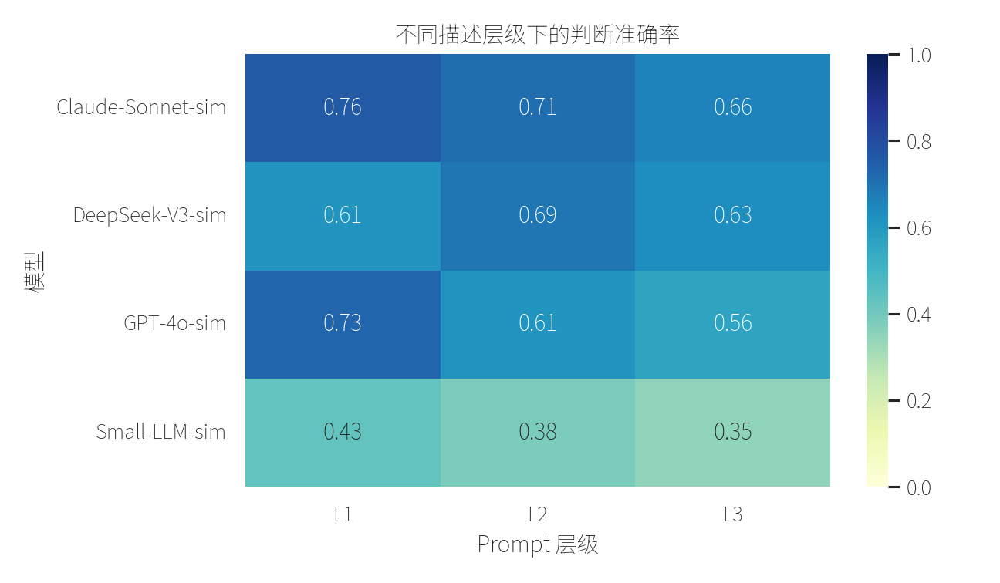
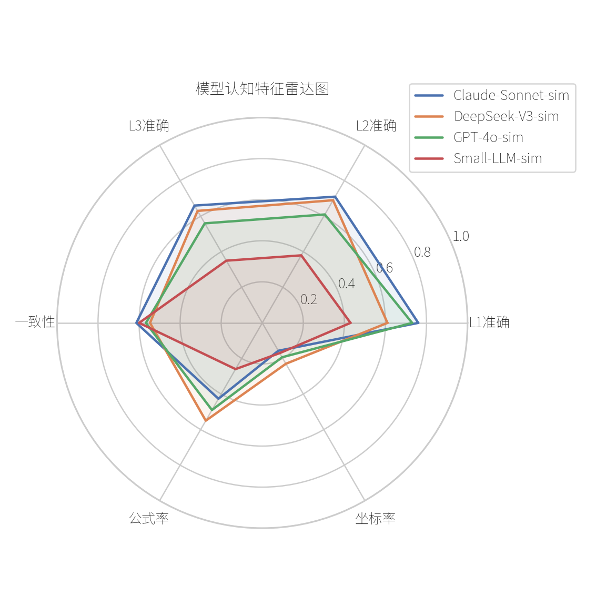

# LLM 空间建模能力挖掘分析

本仓库用于研究大语言模型在空间推理任务中的认知边界。项目以“电动轮椅能否在狭窄楼梯转角处完成 90 度转弯”为固定场景，系统构造不同表达层级和干扰条件下的 Prompt，采集模型回复，并把回复转化为可分析的行为特征。

这个项目关注的不是“如何写一个几何算法算出轮椅能不能过”，而是把模型回答本身作为数据，分析模型在自然语言、参数描述和形式化建模之间是否保持逻辑一致。

## 项目亮点

- 默认生成 `20 个场景 x 3 个描述层级 x 5 类干扰 = 300` 条 Prompt。
- 支持 mock 离线模型，也支持 DF/OpenAI-compatible、OpenAI、Anthropic、DeepSeek 等真实 API。
- 自动抽取模型回复中的最终判断、推理步骤数、公式使用、坐标系使用、错误类型等行为特征。
- 内置准确率热力图、噪声翻转率、层级一致性、决策树、K-Means 聚类和 FP-Growth 关联规则分析。
- 输出可直接用于报告写作的图表、统计表和 `outputs/findings.md` 摘要。

## 研究设计

每个空间场景会被渲染成三种 Prompt 层级：

- `L1`：自然语言描述，只给口语化空间印象。
- `L2`：具体参数描述，给楼梯净宽、平台进深、轮椅尺寸和转弯半径。
- `L3`：数学建模描述，给 L 形通道、坐标系、矩形刚体和旋转包络判据。

每个 Prompt 又会叠加不同干扰条件：

- `none`：无干扰。
- `material_color`：扶手颜色、墙面材质等无关视觉信息。
- `ambient_noise`：现场噪声。
- `lighting`：光照、地面状态。
- `emotional_pressure`：催促、紧张等情绪压力。

核心分析问题包括：

- 描述越形式化，模型是否真的更准确？
- 同一场景从 L1 到 L3 时，模型判断是否一致？
- 无关环境信息是否会诱发判断翻转？
- 错误回答主要属于概念混淆、计算崩溃、噪声牵引还是直觉过拟合？

更完整的实验说明见 [docs/experiment_design.md](docs/experiment_design.md)。

## 仓库结构

```text
.
├── config/
│   ├── experiment.yml              # 实验配置、模型列表、API 参数、挖掘阈值
│   └── noise_keywords.yml          # 噪声关键词词表
├── data/
│   ├── prompts.csv                 # Prompt 实验矩阵
│   ├── raw/model_responses.csv     # 模型原始回复
│   └── processed/behavior_features.csv
├── docs/
│   ├── experiment_design.md
│   └── how_to_run_experiment.md
├── outputs/
│   ├── figures/                    # 热力图、雷达图、聚类图等
│   ├── tables/                     # 准确率、翻转率、关联规则等结果表
│   └── findings.md                 # 自动生成的关键发现摘要
├── scripts/
│   ├── run_pipeline.py             # 一键运行 mock 离线流程
│   ├── 01_generate_prompts.py
│   ├── 02_collect_responses.py
│   ├── 03_build_features.py
│   └── 04_analyze.py
├── src/spatial_llm_mining/         # 核心代码
└── tests/                          # 单元测试
```

## 快速开始

建议使用 Python 3.10 或更高版本。以下命令以 PowerShell 为例：

```powershell
python -m venv .venv
.\.venv\Scripts\Activate.ps1
pip install -r requirements.txt
```

运行完整的 mock 离线流程：

```powershell
python scripts/run_pipeline.py
```

mock 模式不需要 API key，会生成可复现的样例数据和分析结果：

- `data/prompts.csv`
- `data/raw/model_responses.csv`
- `data/processed/behavior_features.csv`
- `outputs/figures/*.png`
- `outputs/tables/*.csv`
- `outputs/findings.md`

运行测试：

```powershell
pip install pytest
python -m pytest
```

## 使用真实模型 API

`config/experiment.yml` 中只保留 API 地址、模型名和采样参数，不提交真实密钥：

```yaml
api:
  base_url: "http://123.129.219.111:3000/v1"
  api_key: ""
```

真实采集前，请在当前 shell 中设置环境变量：

```powershell
$env:DF_API_URL="http://123.129.219.111:3000/v1"
$env:DF_API_KEY="你的密钥"
```

先做一次连通性测试：

```powershell
python scripts/test_api_connection.py --model gpt-4o
```

正式采集：

```powershell
python scripts/01_generate_prompts.py
python scripts/02_collect_responses.py --provider df --models gpt-4o,gpt-4o-mini --repeats 3 --resume
python scripts/03_build_features.py
python scripts/04_analyze.py
```

`02_collect_responses.py` 常用参数：

- `--resume`：跳过已有的 `(model, repeat, prompt_id)` 记录，适合断点续采。
- `--limit N`：只新增 N 次调用，适合小样本测试。
- `--on-error skip|abort`：单次 API 失败时跳过或终止。
- `--models a,b,c`：指定逗号分隔的模型列表。

其他 provider 示例：

```powershell
python scripts/02_collect_responses.py --provider openai --models gpt-4.1,gpt-4o-mini
python scripts/02_collect_responses.py --provider anthropic --models claude-3-5-sonnet-latest
python scripts/02_collect_responses.py --provider deepseek --models deepseek-chat
```

对应环境变量：

- `OPENAI_API_KEY`
- `ANTHROPIC_API_KEY`
- `DEEPSEEK_API_KEY`

生成 11 组额外实验设计型 Prompt 构造策略数据：

```powershell
python scripts/generate_prompt_strategies.py
```

每组策略会单独写入 `data/prompts_<strategy>.csv`，策略说明汇总在 `data/prompt_strategy_manifest.csv`。这些策略不是原始哈希构造法的简单扩展，而是覆盖空间填充、正交实验、分数因子、反事实扰动、约束边界求解和对抗线索等实验设计思路。

当前额外策略包括：

- `latin_hypercube_coverage`
- `halton_space_filling`
- `orthogonal_array_interactions`
- `fractional_factorial_effects`
- `d_optimal_balanced_subset`
- `dimensionless_ratio_design`
- `metamorphic_counterfactual_pairs`
- `constraint_boundary_solver`
- `conflicting_cue_adversarial`
- `real_world_archetype_matrix`
- `rounding_threshold_ladder`

## 数据说明

主要数据文件：

- `data/prompts.csv`：Prompt 矩阵。包含 `prompt_id`、`case_id`、`level`、`noise_label`、尺寸参数、参考判断和完整 Prompt。
- `data/raw/model_responses.csv`：模型回复原始记录。包含 Prompt 字段、`provider`、`model`、`repeat`、`collected_at` 和 `response`。
- `data/processed/behavior_features.csv`：从回复中抽取的行为特征。包含 `ai_judgment`、`is_correct`、`reasoning_steps`、`has_formula`、`uses_coordinate`、`error_category` 等。

CSV 中的 `prompt` 和 `response` 字段包含多行文本，用文本编辑器直接查看会比较拥挤。建议使用 Excel、LibreOffice、VS Code CSV 插件或 Pandas 读取。

## 输出说明

核心输出位于 `outputs/`：

- `outputs/tables/accuracy_by_level.csv`：不同模型在不同层级下的准确率。
- `outputs/tables/noise_flip_rate.csv`：无关噪声导致判断翻转的比例。
- `outputs/tables/level_consistency.csv`：同一场景跨层级判断是否一致。
- `outputs/tables/failure_modes.csv`：错误类型分布。
- `outputs/tables/outcome_rules.csv`：面向结果变量的 FP-Growth 关联规则。
- `outputs/tables/error_text_clusters.csv`：错误回复文本聚类结果。
- `outputs/findings.md`：自动生成的关键发现摘要。

示例图表：





## 可选报告

如果需要生成 PDF 报告：

```powershell
python scripts/04_analyze.py --build-report
```

输出文件为：

```text
reports/analysis_report.pdf
```

## 安全与复现注意事项

- 不要把 API key 写入 `config/experiment.yml`、README、CSV 或任何提交文件。
- `.env.example` 只作为变量名参考；项目不会自动读取 `.env`，需要在 shell 中显式设置环境变量。
- 如果真实模型采集正在运行，`data/raw/model_responses.csv` 会持续追加。提交前请确认采集进程已经结束，或明确只提交当前快照。
- mock 数据用于验证流程和展示分析方法，不代表真实模型能力。
- 使用真实 API 结果写报告时，请记录模型版本、采集日期、temperature、max_tokens、repeats 和失败重试情况。

## 相关文档

- [实验设计](docs/experiment_design.md)
- [运行说明](docs/how_to_run_experiment.md)
- [自动发现摘要](outputs/findings.md)
